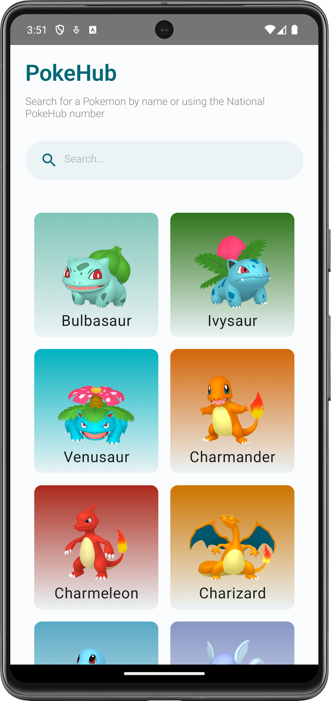
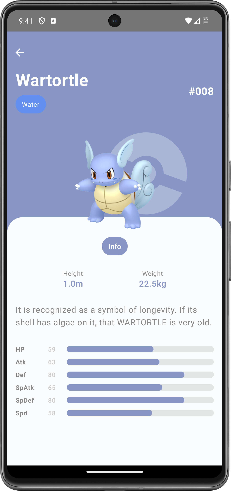
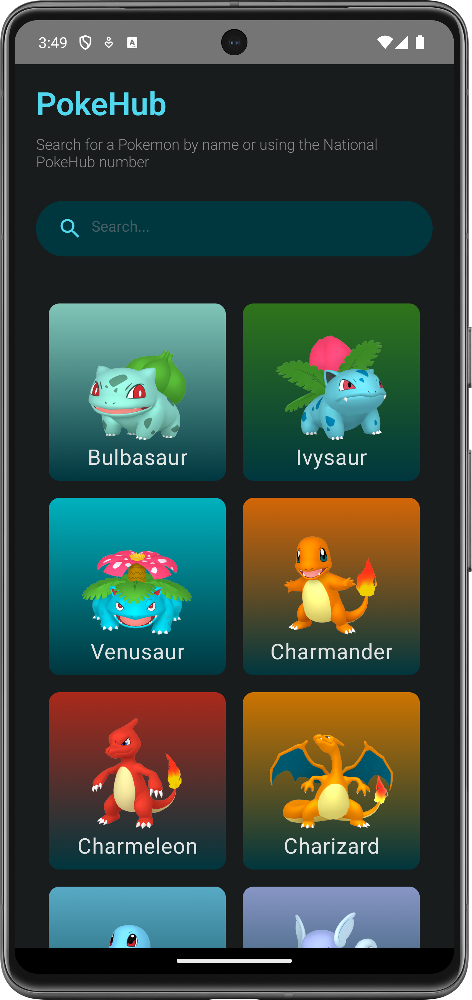
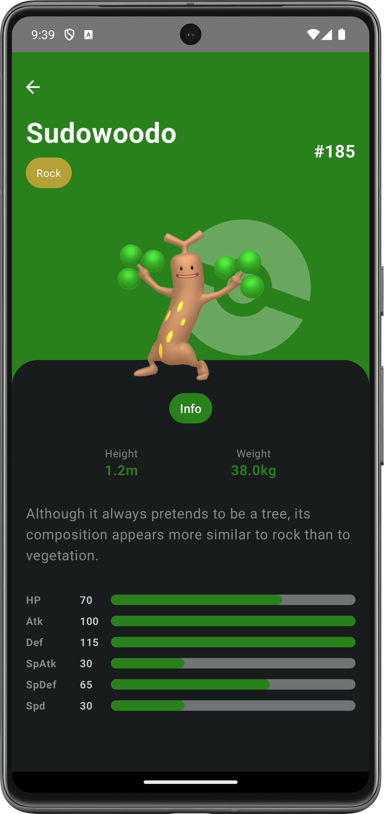

# PokeHub
PokeHub is an Android application designed for Pokémon enthusiasts to explore information about different Pokémon. The app utilizes various technologies and follows modern architecture principles to provide a seamless user experience.

## Features
- View a list of Pokémon species with their basic information.
- Search for specific Pokémon by name.
- View detailed information about individual Pokémon.
- Explore images of Pokémon.
- Utilizes Dagger Hilt for dependency injection.
- Uses Coil for efficient image loading.
- Integrates Retrofit for making network requests to the PokeAPI.
- Incorporates Palette for extracting colors from Pokémon images.
- Supports both dark and light themes.

## Technologies Used
- **Dagger Hilt:** Dependency injection framework for managing dependencies efficiently.
- **Coil:** Image loading library for loading Pokémon images seamlessly.
- **Retrofit:** Type-safe HTTP client for making API requests to the PokeApi.
- **Palette:** AndroidX library for extracting prominent colors from images, used for UI theming.

## Architecture
The PokeHub app follows the MVVM (Model-View-ViewModel) architecture pattern with a touch of Clean Architecture principles, ensuring separation of concerns and maintainability.

- **data:** Contains data-related components following Clean Architecture principles:
  - **model:** Data models representing Pokémon attributes.
  - **remote:** Contains the PokeApi interface and network-related classes.
  - **repository:** Repositories responsible for coordinating data retrieval from different sources.
- **di:** Dependency Injection module using Dagger Hilt for managing dependencies.
- **ui:** User interface components:
  - **screens:** RecyclerView adapters for displaying Pokémon in a list
  - **viewmodels:** ViewModels for managing UI-related data and business logic.

## Screenshots

    &nbsp;&nbsp;&nbsp;&nbsp;&nbsp; 
    &nbsp;&nbsp;&nbsp;&nbsp;&nbsp; 
    &nbsp;&nbsp;&nbsp;&nbsp;&nbsp; 
    

## Getting Started
To build and run the PokeHub app locally, follow these steps:

1. Clone the repository: `git clone https://github.com/BotsheloRamela/PokeHub.git`
2. Open the project in Android Studio.
3. Build and run the app on an emulator or physical device.

## Credits
- [PokeApi](https://pokeapi.co/): The primary data source for Pokémon information.

## License
This project is licensed under the MIT License - see the [LICENSE](LICENSE) file for details.
